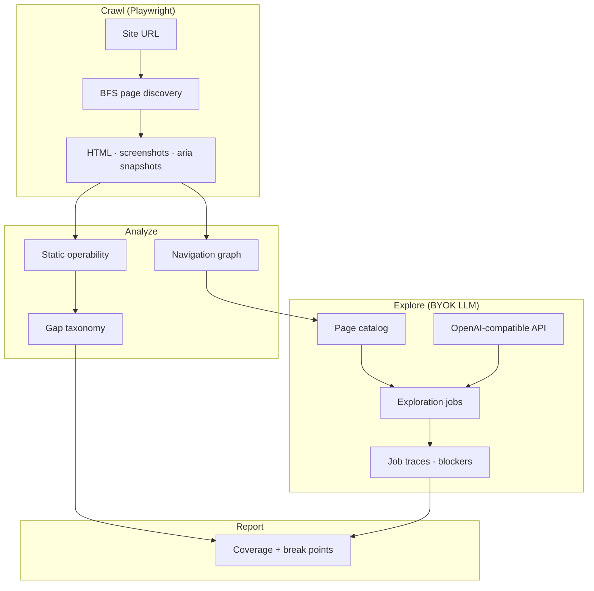

<p align="center">
  
</p>

<h1 align="center">OpenIngress</h1>

<p align="center">
  <strong>can AI agents use your site?</strong><br>
  Self-hosted Playwright crawl, accessibility inspection, and LLM-guided exploration for live public sites.
</p>

<p align="center">
  <a href="LICENSE"></a>
  <a href="https://www.python.org/"></a>
  <a href="https://vuejs.org/"></a>
</p>

<p align="center">
  <a href="https://openingress.dev">openingress.dev</a> ·
  <a href="#architecture">Architecture</a> ·
  <a href="#quick-start">Quick start</a> ·
  <a href="SELF_HOST.md">Self-host</a>
</p>

---

## Background

### The problem

AI agents are starting to browse the web for people — opening pages, clicking buttons, filling forms. A site can look fine in a browser and still be hard for an agent to use: buttons without labels, pages that only load in JavaScript, links that never show up in the page structure agents read.

Being findable (SEO, citations, `llms.txt`) is not the same as being usable by an agent on the live site.

### What OpenIngress does

OpenIngress crawls a site like a browser would, inspects what an agent can actually see and click, then runs LLM-guided tasks against that crawl. The output is a report: which pages were reached, what broke, and where navigation stalled.

## Architecture



| Stage | Input | Output |
|-------|-------|--------|
| **Crawl** | Public URL | Page graph, DOM, screenshots, Playwright accessibility snapshots |
| **Analyze** | Crawl artifacts | Operability scores, label coverage, `llms.txt`, hydration checks, gap taxonomy |
| **Explore** | Catalog + LLM key | Reachability jobs, task attempts, blocker evidence |
| **Report** | Analysis + job results | Readiness metrics, break points, markdown export |

Default crawl bounds: depth **3**, max **100** pages.

## Stack

| Layer | Components |
|-------|------------|
| API | Flask, Gunicorn |
| Automation | Playwright (Chromium), Python 3.10+ |
| Exploration | OpenAI-compatible LLM (Azure, Gemini, Ollama, local proxy) |
| UI | Vue 3, Vite |
| Persistence | Local filesystem |

## Quick start

```bash
cp backend/.env.example backend/.env
cp frontend/.env.example frontend/.env

# LLM_API_KEY required in backend/.env

make install    # venv + pip + Playwright Chromium + npm
make backend    # terminal 1 — API :5055
make frontend   # terminal 2 — UI :5175
```

Needs **Python 3.10+** (or `python3`) and **Node 18+**. `make install` downloads Chromium for Playwright.

Configuration, Docker, and deployment: [SELF_HOST.md](SELF_HOST.md).

## Configuration

| Variable | Required | Description |
|----------|----------|-------------|
| `LLM_API_KEY` | yes | Provider key (OpenAI or compatible) |
| `LLM_BASE_URL` | no | Custom endpoint |
| `LLM_MODEL_NAME` | no | Default `gpt-4o-mini` |
| `AUTH_DISABLED` | no | Default `1` (local OSS) |
| `VITE_AUTH_DISABLED` | no | Default `1` in `frontend/.env.example` |

Runs and exploration require a configured LLM key.

## Repository layout

| Path | Description |
|------|-------------|
| `backend/` | Flask API, crawl/explore workers, report generation |
| `frontend/` | Vue dashboard |
| `docs/` | Agent brief, Playwright recording notes |
| `Dockerfile` | Playwright + Gunicorn container |

## License

[MIT](LICENSE)
